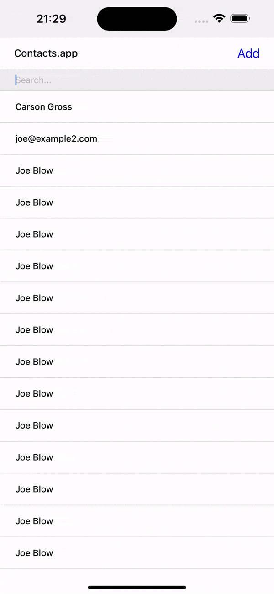

# Hypermedia apps with HTMX, HXML, Go and Templ

This repo is an implementation of the example Contacts.app from the book [Hypermedia Systems](https://hypermedia.systems/),
a wonderful book about, well, Hypermedia.  
All HTMX and HXML code relevant to the book can can be found in [app/hypermedia](app/hypermedia).  
It remains true to the book's examples for the most part, making a few small css styling adjustments here and there.

The project structure was geared towards a more production-oriented approach, and is inspired by [Ardan Labs Service Repo](https://github.com/ardanlabs/service). And yes, some of the structural code was taken directly from there for ease of learning htmx.  
Naturally, this is far from anything production ready. There is no auth, and the "DB" is, well, a slice of json objects loaded into memory :).

#### <span style="color:red">All makefile commands below have been tested on MacOS only.</span>

## Run the web example
```shell
make up
```
Navigate to http://localhost:42069/

## Run the Mobile example
We leverage the [Hyperview](https://github.com/Instawork/hyperview.git) demo to bootstrap our demo. 

Install the required libs, iOS simulator, and copy relevant files:
```shell
make dev.setup.mobile
```
Run the backend
```shell
make up
```
In another terminal window, start the iOS simulator*
```shell
make mobile
```
*Alternatively, you can navigate to [hyperview/demo/](hyperview/demo/) and use one of the other options to run the demo,
but note that Android simulator requires our app to listen on the same IP as your machine. (maybe can add as config later).




### Dev
### Install Templ and WGO command line tools.
```shell
make dev.setup
```
### Run wgo with templ file watching to auto-reload changes
```shell
make dev
```

## TODO enhancements/issue:
- Better flash handling: currently just stuffing into context.
- Smooth progress bar transition, needed to use JS, possible without?
- Web cannot delete single contact with checkbox (alpine / sweet confirm), not sure why.
